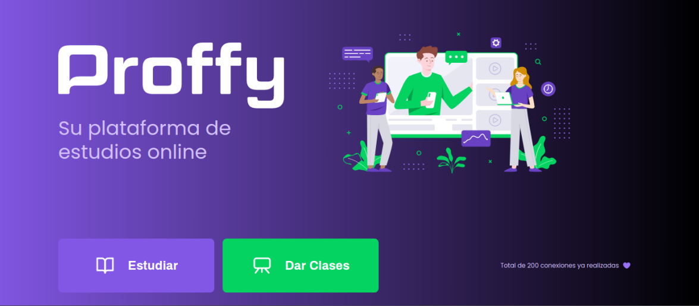

<p align="center">
  
</p>

<p align="center">
  
</p>

# <p align="center">💻<span style="color: #6842c2"> Proffy </span>- Nex Level Week#2 </p>

<p align="center">
  <a href="#-sobre">Sobre</a>&nbsp;&nbsp;&nbsp;|&nbsp;&nbsp;&nbsp;
  <a href="#-como-ejecutar-el-proyecto">Como ejecutar el proyecto</a>&nbsp;&nbsp;&nbsp;|&nbsp;&nbsp;&nbsp;
  <a href="#-tecnologías-Utilizadas">Tecnologías Utilizasas</a>&nbsp;&nbsp;&nbsp;|&nbsp;&nbsp;&nbsp;
  <a href="#-licencia">Licencia</a>
</p>


## Sobre
Es una Plataforma de Estudios Online creada en honor al día 
del Educador en Brasil, en donde las personas podrán estudiar o dar clases, para estudiar tendrá una pagina en donde los estudiantes podrán filtrar los profesores disponibles de acuerdo a la materia y horario ingresada por el estudiante y para dar clases tendrá una pagina con un formulario donde el profesor interesado podrá registrarse.

## Como ejecutar el proyecto? 🤔

Estas instrucciones te permitirán obtener una copia del proyecto en funcionamiento en tu máquina local para propósitos de desarrollo y pruebas.

### Instalación y ejecución a través del terminal 🔧

Abra el terminal de su computadora y realice los siguientes pasos:


```bash
#Clone el repositorio
git clone https://github.com/marialares/Proffy-Nex-Level-Week-2

# Entre en el directorio
cd proffy_nlw

# Baje las dependencias
npm i

# Inicie el servidor de desenvolvimiento
npm run dev
```

### Después del paso anterior, abra su navegador y acesse `http://localhost:5500/`


## Tecnologías Utilizadas 🛠️

* [JavaScript](https://www.javascript.com/)
* [HTML](https://www.w3schools.com/html/)
* [CSS](https://www.w3.org/Style/CSS/Overview.en.html)
* [Node.js](https://nodejs.org/en/)
* [Express](https://expressjs.com/)
* [SQLite](https://www.sqlite.org/index.html)
* [Nunjucks](https://mozilla.github.io/nunjucks/)

## Licencia 📄

Este proyecto está bajo la Licencia MIT- mira el archivo [LICENSE](LICENSE.md) para detalles

## Gracias 🎁

* **Rocketseat** - *Plataforma de educación en tecnología* - [Rocketseat](https://github.com/rocketseat)

* **Tiago Luchtenberg** - *Diseñador de la interfaz* - [tiagoluchtenberg](https://www.instagram.com/tiagoluchtenberg/)

* **Mayk Brito** - *Profesor guía* - [maykbrito](https://github.com/maykbrito)

---
⌨️ con ❤️ por [Maria Lares](https://www.linkedin.com/in/maria-lares) 😊
